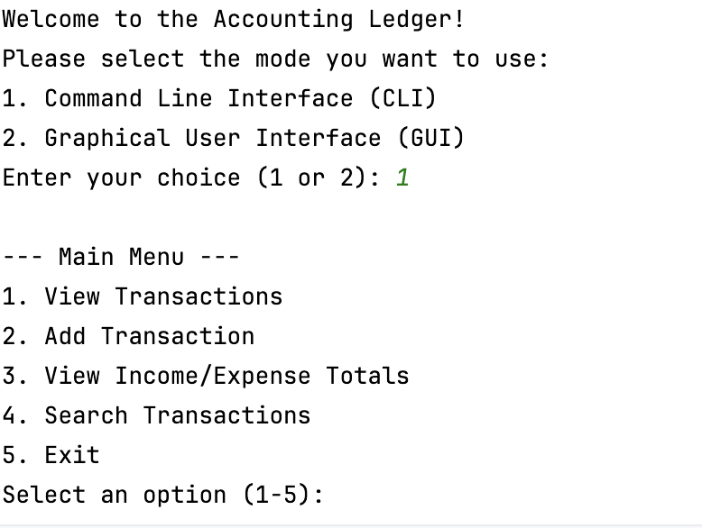
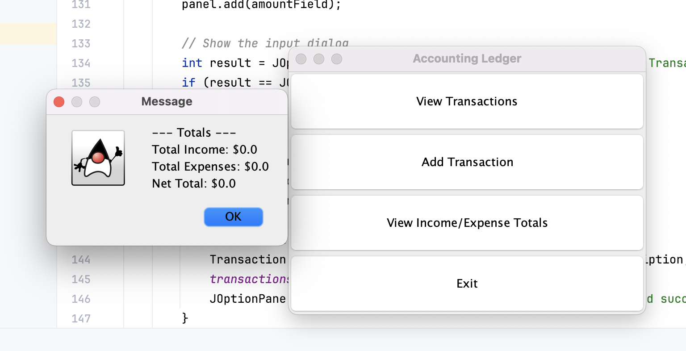
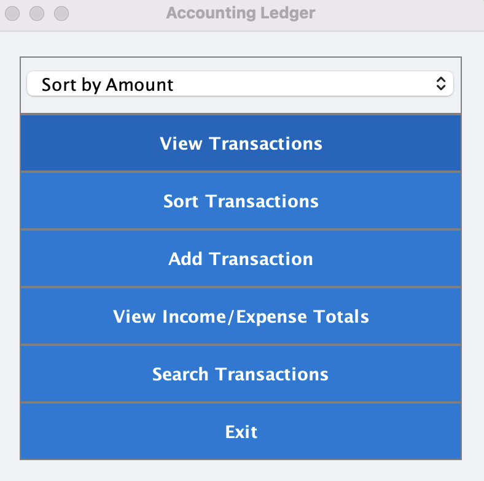
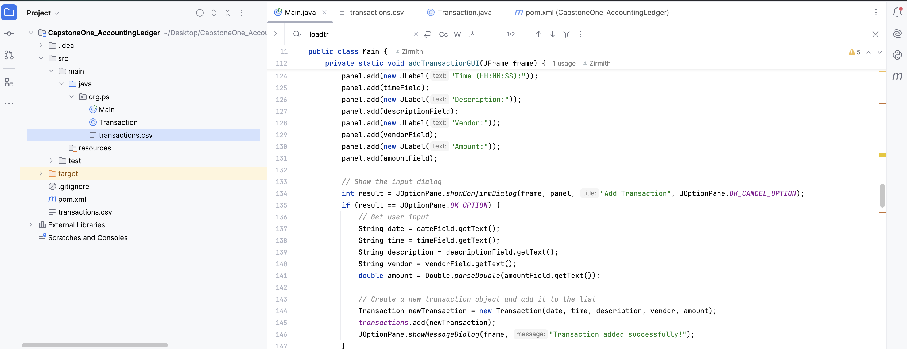

# Accounting Ledger Application

This Accounting Ledger application is developed as part of the **CapstoneOne_AccountingLedger** assignment. It manages financial transactions and supports both Command Line Interface (CLI) and Graphical User Interface (GUI) modes, allowing users to view, add, and calculate income and expenses.

## Features

- **CLI Mode**: View, add transactions, and calculate income/expense totals through text-based commands.
- **GUI Mode**: User-friendly graphical interface using Java Swing, providing similar functionality as the CLI.
- **Data Storage**: Transactions are saved and loaded from a CSV file (`transactions.csv`).
- **Transaction Validation**: Ensures date, time, and amount inputs are in the correct format.
- **CSV Handling**: Reads and writes to a pipe-delimited CSV file.

## How It Works

1. **Startup**: 
    - When the application starts, it prompts the user to select a mode (CLI or GUI).
    - Based on the user’s selection, the appropriate interface is launched.

2. **CLI Mode**: 
    - Available options include viewing transactions, adding transactions, viewing income/expense totals, and exiting.
    - Transactions are entered manually with date, time, description, vendor, and amount.

3. **GUI Mode**: 
    - Similar to CLI, but with a graphical interface.
    - Buttons allow users to perform actions such as viewing transactions, adding new transactions via a form, and viewing totals.

4. **Transactions**:
    - Each transaction includes the following fields: `date`, `time`, `description`, `vendor`, `amount`.
    - Positive amounts indicate income, while negative amounts indicate expenses.

## Installation

1. Clone the repository or download the source files.
2. Open the project in your Java IDE (IntelliJ, Eclipse, etc.).
3. Ensure that the `transactions.csv` file is present in the project directory, or the application will create a new one.
4. Compile and run the `Main.java` file.

## Requirements

- Java 8 or higher

## Usage

1. When prompted, choose between CLI (enter `1`) or GUI (enter `2`) mode.
2. Use the provided options in the selected mode to manage your transactions.

## Image Showcase

Here are some images of the Accounting Ledger application in action:

*CLI Mode: View Transactions*

*GUI Mode: Add Transaction*

## Video Demonstration

Watch the video demonstration of the Accounting Ledger application:

*Click the image above to watch the demonstration.*

## License

This project is licensed under the MIT License.

## Changes Made:
- **Features**
  - Added the sorting feature to the features section.
  

